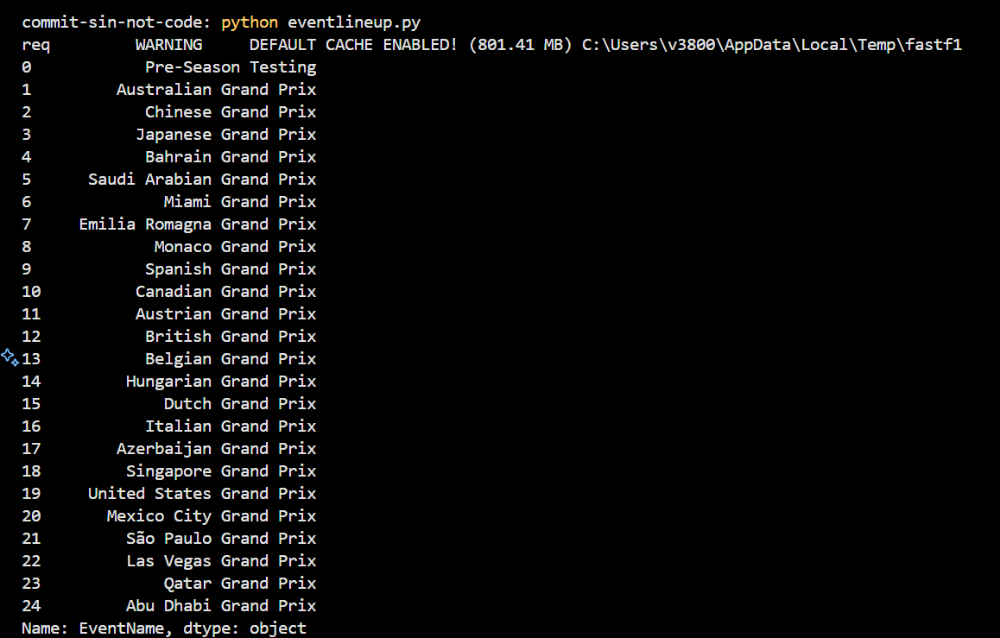
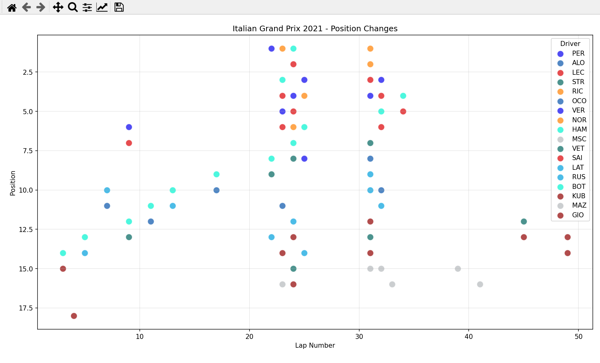
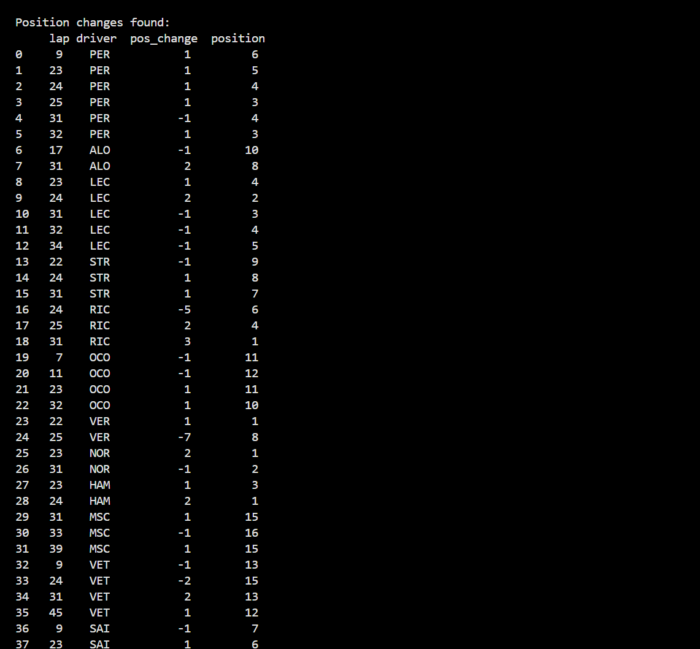
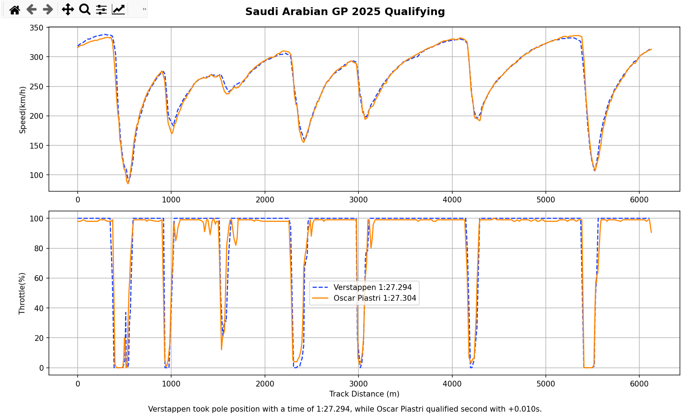
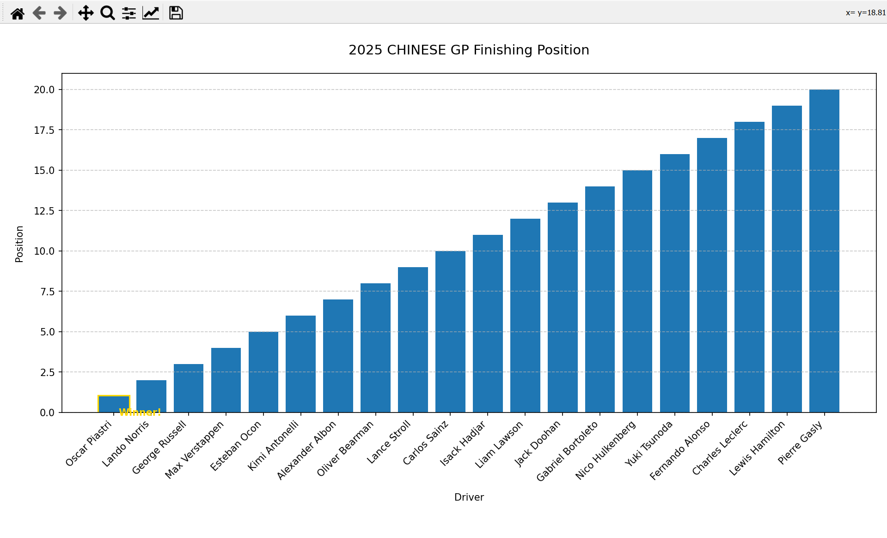
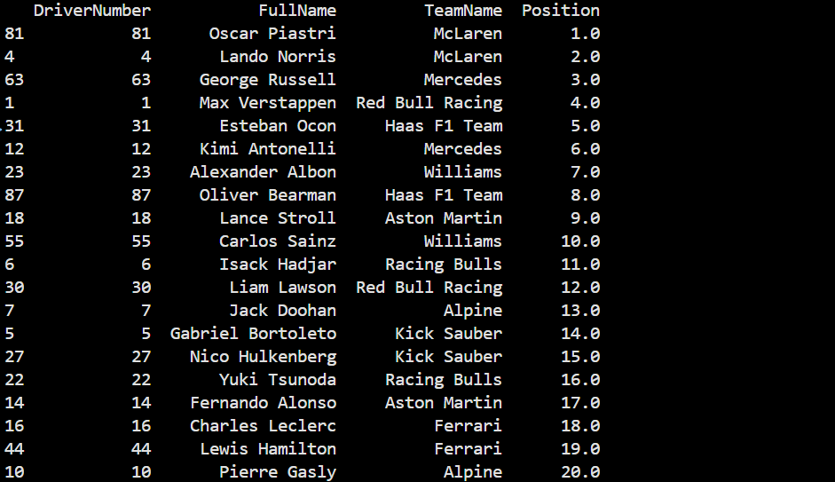
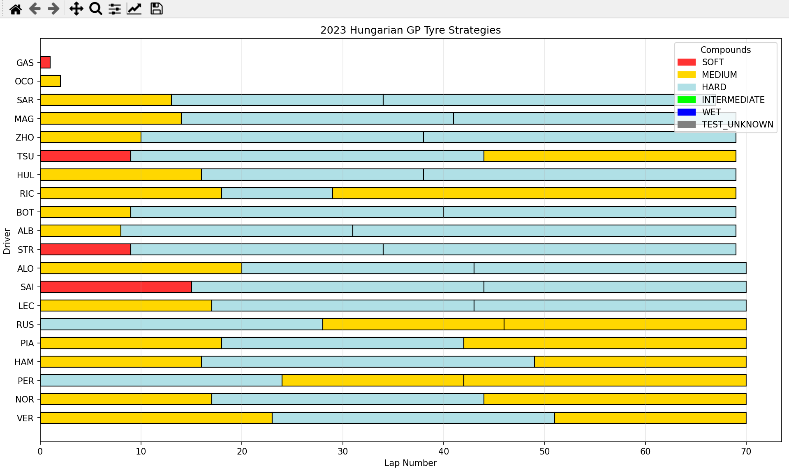

# 🏎️ fastf1-visuals

Welcome to the pit lane of Python + F1 🛠️🏁

This repo contains a set of visual data projects built using [FastF1](https://theoehrly.github.io/Fast-F1/) — an open-source library for accessing Formula 1 timing data and Matplotlib.  
From finishing positions and tyre strategies to telemetry battles and scatter plots of chaos, it's here.

---

## 📦 What's Inside

| File Name                        | Description |
|----------------------------------|-------------|
| \`eventlineup.py\`                | Prints the 2025 season schedule using FastF1. |
| \`italian_gp_position_scatter.py\`       | Scatterplot of driver position changes per lap during the 2021 Italian GP — it's chaos visualized. |
| \`qualifying_telemetry_plot.py\`  | Telemetry comparison (speed + throttle) between Verstappen and Piastri for Saudi Arabian GP qualifying. |
| \`race_results_bar.py\`       | Bar chart of finishing positions for 2025 Chinese GP with team colors. Winner gets a gold outline. |
| \`tyre_strategy_bar.py\`          | Visual breakdown of tyre stints by compound and lap for the 2023 Hungarian GP. |

---

## 🚀 Getting Started

### 🔧 Requirements

- Python 3.8+
- [FastF1](https://pypi.org/project/fastf1/)
- \`matplotlib\`
- \`pandas\`

Install dependencies:

\`\`\`bash
pip install -r requirements.txt
\`\`\`

### ▶️ Run any script

\`\`\`bash
python barfight_in_shanghai.py
\`\`\`

> All scripts pull live data using FastF1 and generate visualizations. Internet required (unless all the data is already cached).

---

## 📸 Outputs

  
🏁 Events For F1 2025

Shows all the races that will be held in 2025

  
🎢 Italian GP 2021 – Position Chaos Tracker

Position Scatter.

Tabular form in the console.

Scatterplot showing how drivers gained/lost positions lap-by-lap.

  
🧪 Saudi Arabian GP 2025 – Telemetry Comparison

Speed and throttle comparison between Max Verstappen and Oscar Piastri during qualifying.  
0.010s difference. Epic stuff.

  
🏁 Chinese GP 2025 – Finishing Positions

The graph.

The data is displayed on the console.

Bar chart showing finishing order, color-coded by team.  
Gold outline for the winner (Verstappen, obviously).

  
🎯 Hungarian GP 2023 – Tyre Strategy Breakdown

The graph.

The data is displayed on the console.

Bar chart showing tyre stints for each driver by compound.  

---

## 🙌 Contributions & Feedback

Discovered a bug? Got a new GP’s telemetry to add? Or scratching your head over the complete lack of comments?
Go ahead open a pull request or raise an issue. Contributions (and constructive chaos) are always welcome.

---

---

## 🛡️ License

MIT - feel free to fork, reuse, and build on top of it.

---

